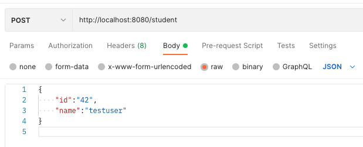
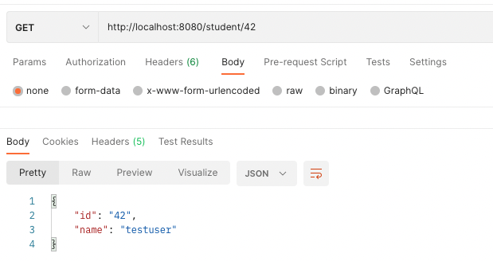

# cgn-221-springstudent
> This is an exercise project for neue fische course cgn-java-22-1

## Usage of repo
In this description we use

- [postman](http://postman.com)
- [IntelliJ](https://www.jetbrains.com/de-de/idea/download/)

1. Clone the repo.
2. Run cgn-221-springstudent application e.g. in IntelliJ.
3. Start a postman project.
4. In Postman prepare the Studentservice with
    1. 
    2. Do the same with other ``ìd`` and ``name`` pairs.
    3. E.g. we can get now the posted student from the repo with .

## Usage of default template used here
See [Github documentation](https://docs.github.com/en/repositories/creating-and-managing-repositories/creating-a-repository-from-a-template)

Both classes ToDelete.java and DeleteThisClassTest can be used to see if project is working from scratch. However, when starting a new project deleting these files is a good idea.

## Contributing

If you'd like to contribute, please fork the repository and use a feature
branch. Pull requests are warmly welcome.
